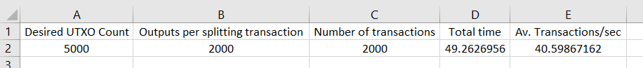

Local or offline development
============================

A command-line based environment is provided for local Bitcoin SV development.
There is no requirement that any developer using it needs to be online while
they use it (after the components are installed).

More details about the SDK can be found here: https://electrumsv-sdk.readthedocs.io/

Running the functional tests & benchmarks
-----------------------------------------

1. Install pytest pre-requisites::

    python3 -m pip install pytest pytest-cov pytest-asyncio pytest-timeout electrumsv_node openpyxl

2. Install the ElectrumSV-SDK (follow instructions here: https://electrumsv-sdk.readthedocs.io/ ) and then do::

    electrumsv-sdk install node
    electrumsv-sdk install electrumx
    electrumsv-sdk install --repo=$PWD electrumsv

This will install the repositories and dependencies for these components.

3. Run the functional tests::

    python3 -m pytest -v -v -v contrib/functional_tests/functional

    contrib\functional_tests\functional\test_reorg.py::TestReorg::test_reorg PASSED
    contrib\functional_tests\functional\test_restapi.py::TestRestAPI::test_get_all_wallets PASSED                                                              [ 25%]
    contrib\functional_tests\functional\test_restapi.py::TestRestAPI::test_load_wallet PASSED                                                                  [ 33%]
    contrib\functional_tests\functional\test_restapi.py::TestRestAPI::test_websocket_wait_for_mempool PASSED                                                   [ 41%]
    contrib\functional_tests\functional\test_restapi.py::TestRestAPI::test_websocket_wait_for_confirmation PASSED                                              [ 50%]
    contrib\functional_tests\functional\test_restapi.py::TestRestAPI::test_get_parent_wallet PASSED                                                            [ 58%]
    contrib\functional_tests\functional\test_restapi.py::TestRestAPI::test_get_account PASSED                                                                  [ 66%]
    contrib\functional_tests\functional\test_restapi.py::TestRestAPI::test_get_utxos_and_top_up PASSED                                                         [ 75%]
    contrib\functional_tests\functional\test_restapi.py::TestRestAPI::test_get_balance PASSED                                                                  [ 83%]
    contrib\functional_tests\functional\test_restapi.py::TestRestAPI::test_concurrent_tx_creation_and_broadcast PASSED                                         [ 91%]
    contrib\functional_tests\functional\test_restapi.py::TestRestAPI::test_create_and_broadcast_exception_handling PASSED

    ============================================================= 11 passed, 1 skipped, 0 failed in 49.53s ==========================================================

4. Run the stresstest benchmarks::

    python3 -m pytest -v contrib/functional_tests/stresstesting

The ElectrumSV daemon will then go about splitting enough utxos for the stresstest and
then will broadcast 2000 transactions via the restapi and wait on the websocket for confirmation
and full processing before stopping the clock.

The default settings for this are (as environment variables)::

    N_TX_CREATION_TASKS = 100
    DESIRED_UTXO_COUNT = 5000
    SPLIT_TX_MAX_OUTPUTS = 2000

Change these environment variables before running the test if you want to try a different
configuration.

The result is exported to::

    contrib/functional_tests/stresstesting/.benchmarks/bench_result.xlsx

With this format:

