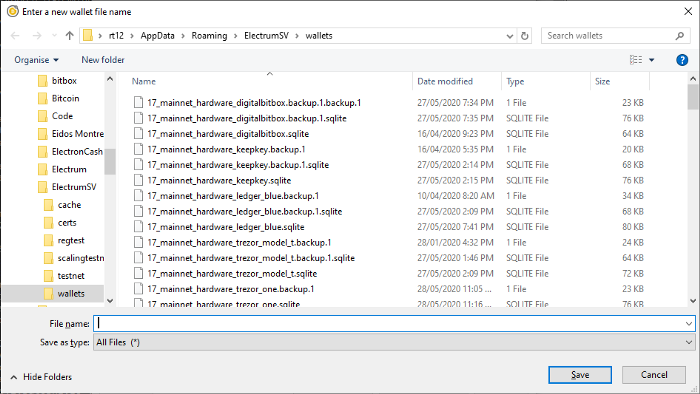
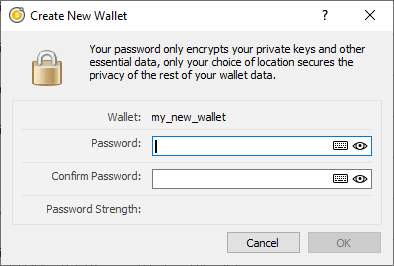
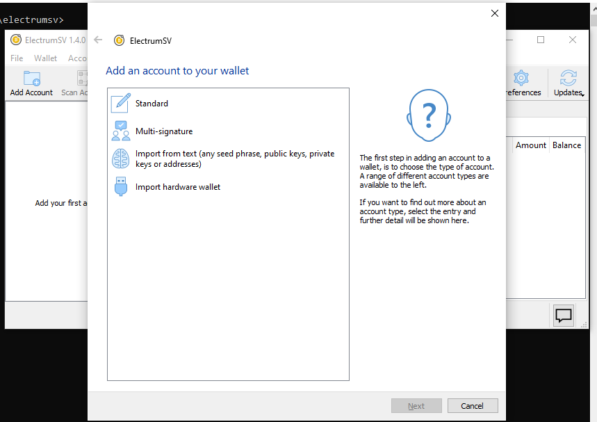
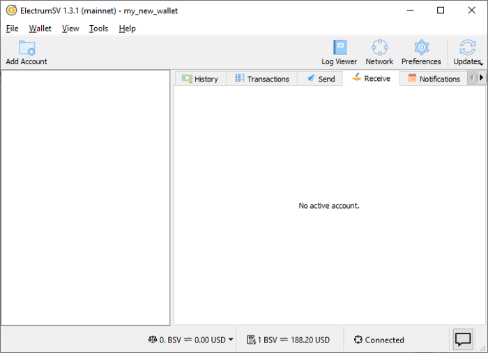

Creating a wallet
=================

From ElectrumSV 1.3 and beyond, a wallet is now a container for your accounts. This guide shows
you how to create an empty wallet with no accounts. After creating the wallet, you will of course
want to add an account to it, in order to be able to start using it.

Choosing the location and file name
-----------------------------------

The first step is to choose where to store your wallet, and what it’s file name should be.
If you choose not to store your wallet in the default location that ElectrumSV uses, it is
likely that you will quickly be able to find it again in the “Recently Opened Wallets” list
when you open it again in the future.

Start off at the wallet selection page.

.. figure:: images/creating-a-wallet-01-selection-page.png
   :alt: blah
   :align: center
   :scale: 80%

   The wallet selection page.

You will be presented with a file dialog that lets you choose where your wallet will be stored,
and what it will be named. It defaults to the standard ElectrumSV wallet location on your
operating system. Enter a file name, and click “Save” (or press the enter key).

   The wallet file name dialog.

Add a mandatory password
------------------------

The next step is setting a password for your new wallet. We require a password and there is no
way to opt out, but you can always enter something like “password” or “123456” if you wish.
This is also required for hardware and watch-only wallets, where there is no key or seed word
data to encrypt.

   The wallet file name dialog.

Once you have entered a password, and confirmed it, the “OK” button will become enabled and you
can click it (or just press the enter key) to open the new wallet.

   The new wallet's wallet window.

Congratulations, you have created a new empty wallet. It will not be usable until you have
created an account, and various parts of the user interface will indicate this.

   The receiving tab is disabled.
