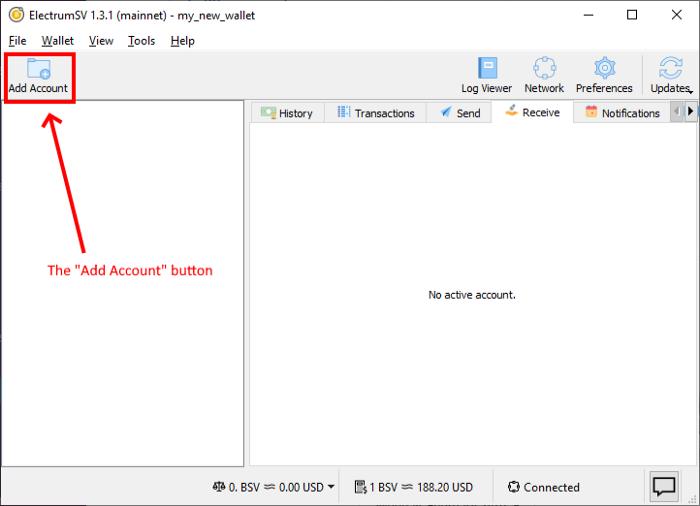
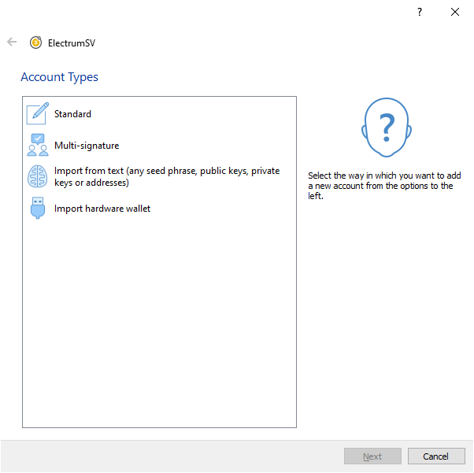
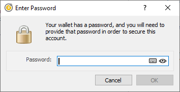
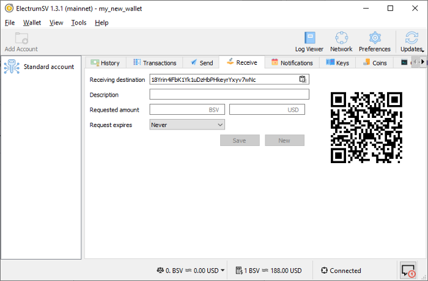
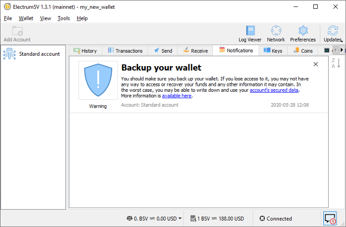

Creating an account
===================

If you are reading this, you likely have a new wallet that has no accounts, and you want to add
one to it. We support addition of a wide variety of account types:

- A new “Standard” account. This is the equivalent of creating a new ElectrumSV seed-word
  based wallet in 1.2.5 and earlier.
- A multi-signature account. Use this if you are creating a new multi-signature account, or
  restoring an existing one from master public keys, seed words and so on.
- Importing from text. Use this to import your seed words, whether Electrum seed words, BIP39
  seed words from another wallet, private keys, public keys, master public keys, master private
  keys, and so on.
- Importing a hardware wallet. If you have an existing hardware wallet that has a seed set up on
  it, then you can use this to add an account that links to it and uses it to sign. If you have
  a hardware wallet that does not have a seed set up on it, you should also be able to use this
  to set it up unless the device is a Ledger. Do not buy a Ledger.

This guide solely covers creating a "Standard" account.

Adding an account
-----------------

In the top-left-hand corner of your wallet window, you will see the “Add Account” button.
Click it and it will open the account wizard which allows all supported types of accounts to be
created.

   The "Add Account" button highlighted.

The account wizard offers four different types of account addition, at the time of writing.

   The Account Types page in the Account Wizard.

Creating a new “Standard” Account
---------------------------------

Double-click on the “Standard” entry to proceed. Or if you prefer to work for it, click the
“Next” button or press the enter key. You will be asked for your password so that the generated
seed words and private key data can be encrypted into your wallet. This also verifies you have
the ability to really use this wallet, and should able to add an account.

   The password dialog.

You will immediately see that the account has been added to your wallet. You will note that at
no point did you have to copy down your new seed words, or confirm them. You will be reminded to
back them up by the wallet, and can do so at your leisure and own risk.

   The new account's receiving tab.

Backing up your seed words
--------------------------

The wallet window now has a notification center, which is used to remind you to deal with
important events, and point out how you can do it.

.. figure:: images/creating-an-account-04-wallet-window-notifications-indicator.png
   :alt: The wallet's notifications indicator.
   :align: center
   :scale: 80%

   The wallet's notifications indicator.

The initial backup notification
-------------------------------

Clicking the notification icon will make the new “Notifications” tab the active one and show the
initial notification about backing up your data.

   The initial backup notification in the wallet's notifications tab.

Follow the link to your secured data
------------------------------------

If you click on the “account’s secured data” link, it will take you directly to that secured
data. But first it will need your password so it can decrypt that data for display.

   The password dialog.

Having entered the correct password you will see the secured data.

.. figure:: images/creating-an-account-07-secured-data-dialog.png
   :alt: The secured data dialog.
   :align: center
   :scale: 80%

   The secured data dialog.

Congratulations, now write down the seed words somewhere safe. I recommend you look into
`SAFEWORDS <https://coinstorage.guru/>`_ to help you with this. You can dismiss the notification
by clicking on the “X” in it’s top right corner.
