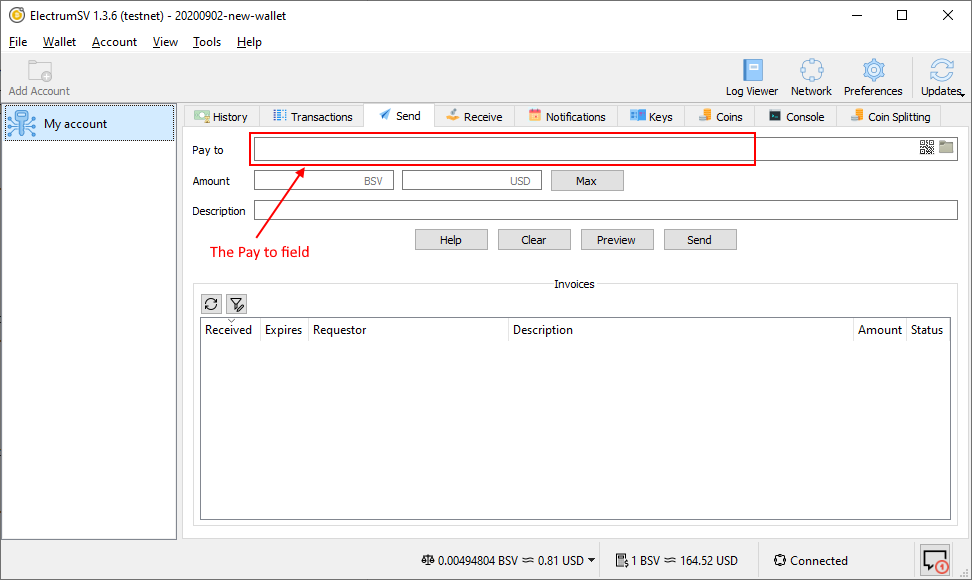
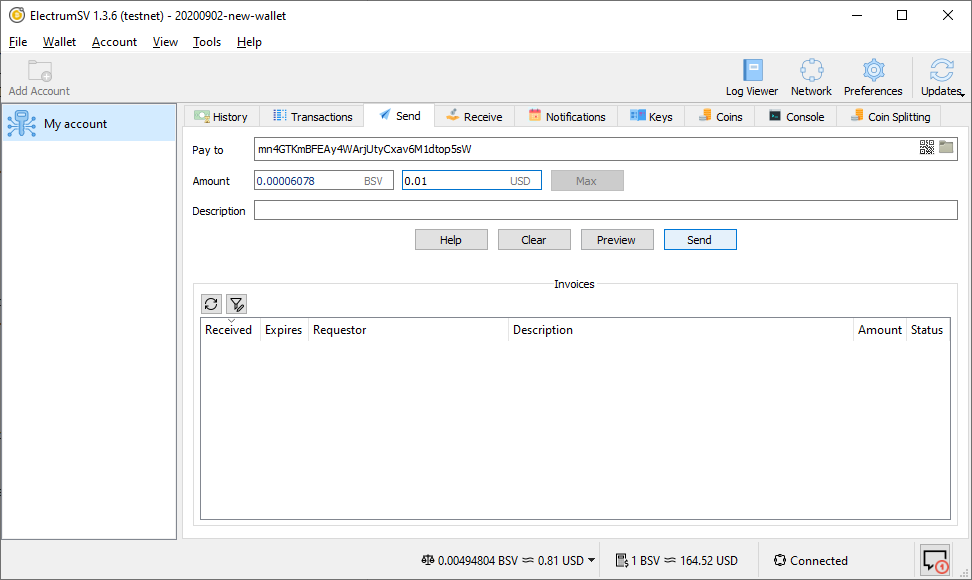
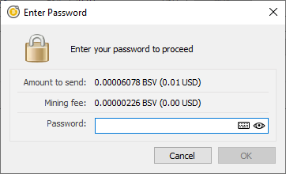
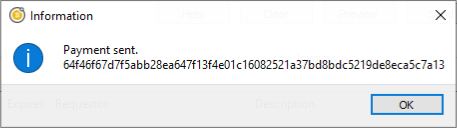
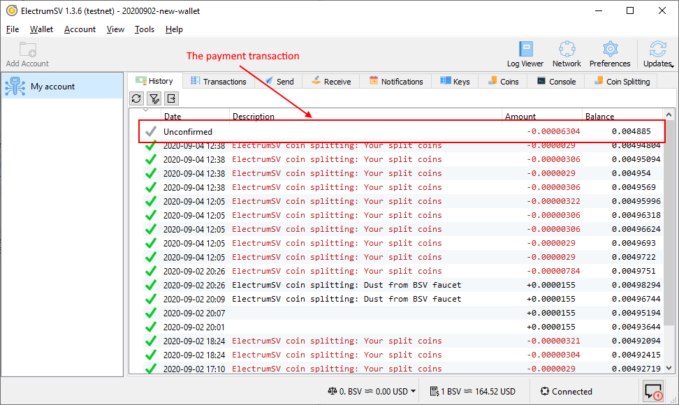

Making a payment
================

If you are reading this, you probably want to know how to make a payment. We currently only support
making payments in the following ways:

- Payment to a Bitcoin address.
- Payment to a
  `BIP276 <https://github.com/moneybutton/bips/blob/master/bip-0276.mediawiki>`_ address.
- Payment to a Bitcoin script.

This guide solely covers payment to an address. It is not recommended you pay to a Bitcoin script
unless you are an expert.

Paying to yourself
------------------

At this point you should have a wallet with a standard account. You should also have an address
from another party, that you can make a payment to. However for the purpose of this guide, you
can make a payment to yourself, if you have no-one else to currently pay.

Start off on the receiving tab.

.. figure:: images/making-a-payment-01-receiving-tab.png
   :alt: Highlighted areas on the receiving tab.
   :align: center
   :width: 80%

   Highlighted areas on the receiving tab.

As you will be paying to yourself, copy the shown address. The best way to do this is to click on
the copy button, which will copy it to the clipboard. You will use this address as you would the
address for any other party.

Paying to an address
--------------------

Ensure your wallet window is now showing the send tab. Select the "Pay to" field and paste in
the address you wish to make a payment to.

   Highlighted areas on the send tab.

After pasting in the address, enter a nominal amount of Bitcoin SV to send, where your wallet
has sufficient funds to do so.

   The filled out send tab.

.. important::
   If you are paying to addresses a good practice is to make what is called a ``pilot payment``
   first, where you pay a small amount you can afford to lose, before paying the larger full
   amount.

Click the "Send" button to start the payment process.

   The password confirmation dialog.

Ensure that both the amount you are sending and the mining fee are the appropriate amounts, then
enter your password and click "OK". The "OK" button only becomes enabled when you have entered
your password correctly. The transaction will broadcast, and you should receive a confirmation
that the payment was made.

   The payment sent dialog.

The confusing sequence of letters and numbers is actually the ID of the transaction that contained
your payment. This can be used to look up your payment, if you were to take it and paste it into
a web site that indexes the Bitcoin SV blockchain.

The record of payment
---------------------

At it's current state of development, the wallet does not have much context about payments made.
But you can see the transactions this account is involved in, in the history tab.

   The highlighted payment transaction in the history tab.

If you had provided a description when making the payment, it would appear here in much the same
way as the existing transactions with their "ElectrumSV coin splitting: Your split coins"
descriptions.