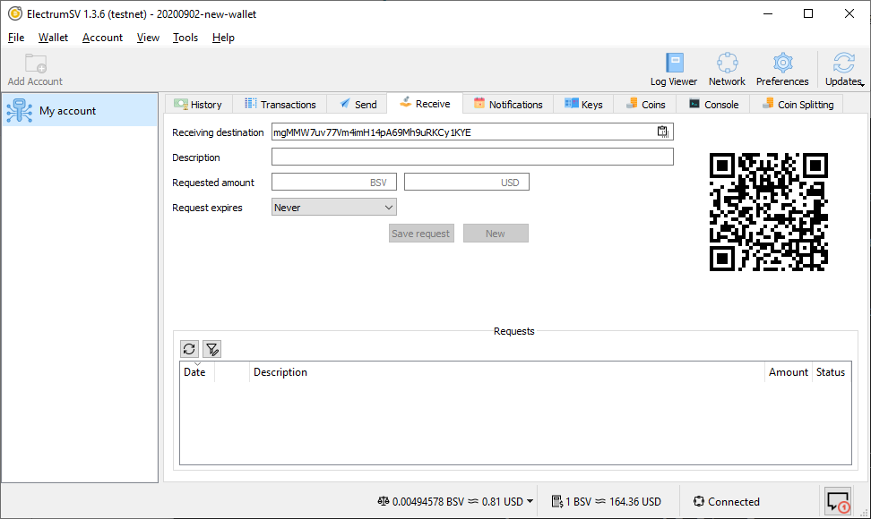
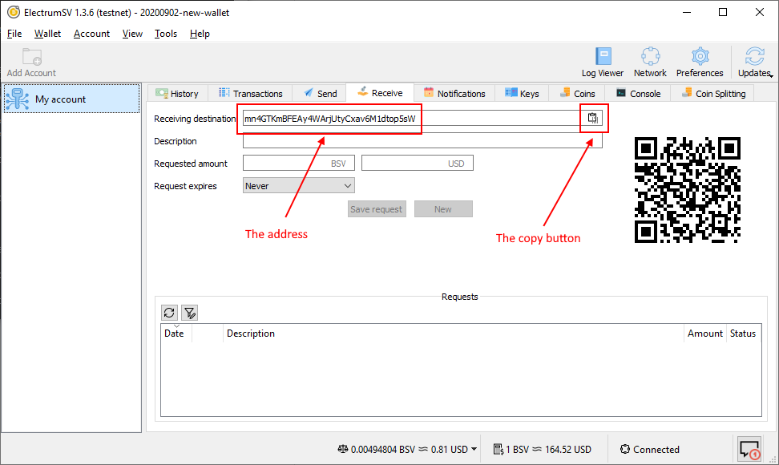
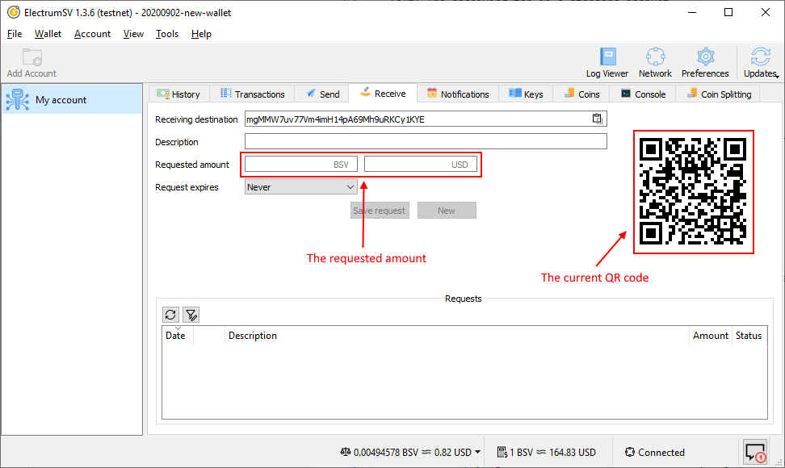
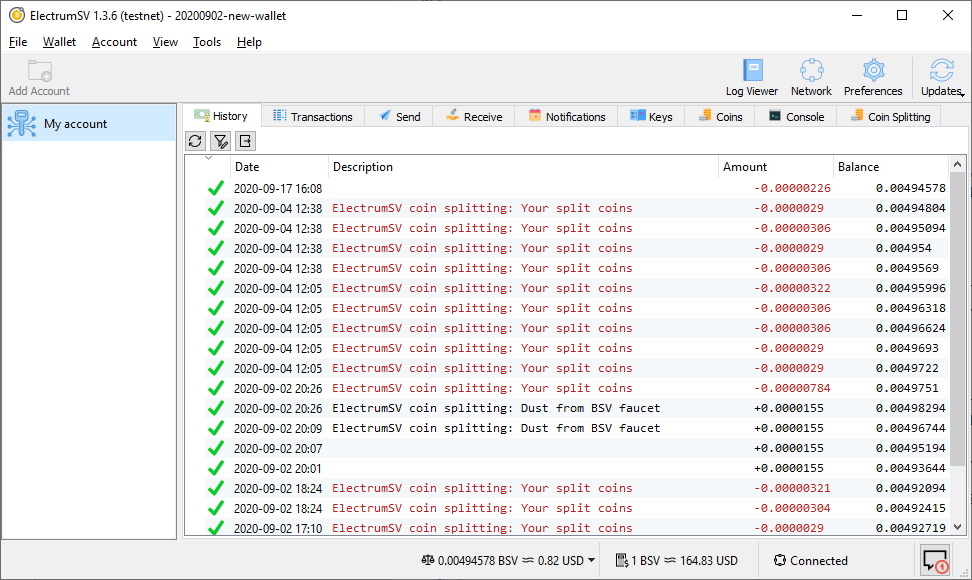

Receiving a payment
===================

There are a number of ways in which you can receive payments to a given account in your
ElectrumSV wallet. At this time, they all involve having the other party pay to a new address
obtained from your account's receive tab.

   The receiving tab in a standard account.

Two ways that someone can make a payment are:

1. You copy the displayed address and give it out.
2. The other party takes a photo of the displayed QR code and their wallet software lets them
   pay to it.

Giving out an address
---------------------

The oldest way to receive a payment is to give out an address from your wallet to the other party,
and then wait for them to pay you. In the future, this will not be supported, but for now it is.
The shown address is automatically replaced with another address, as the wallet detects that the
shown address was used in an incoming payment. This kind of works, but not really, to assist the
user in always giving out a new fresh previously unused address.

   The new address offered in the receiving tab.

.. important::
   The flaw in paying to addresses is that the other party has no way to know that the address
   they get, is the one that you tried to give them. Because they look like random letters and
   numbers it is possible that they can be replaced without either party knowing before it is
   too late. While reports of this happening are rare, it might be worth taking precautions to
   make sure this does not happen to you.

You can copy the address, paste it in an email and send it to the recipient. Paste it into a
chat application. Or get it to them in any number of possible ways.

Using a QR code
---------------

If the other party is standing there with you, you can show them the receiving tab and they
can take a photo of the QR code with their wallet. Their wallet will extract the address and
streamline the payment process. You can fill out the fields with a requested amount to also
include that in the QR code, which further streamlines the process.

   The QR code provided in the receiving tab.

Identifying incoming payments
-----------------------------

In the legacy model, which is still the most common one, payments are fire and forget. The payer
constructs a transaction and broadcasts it to the blockchain. Then when your wallet gets a
notification a payment of interest has appeared in the blockchain, it retrieves that
transaction and factors it into the related account.

   The history tab when awaiting an incoming payment.

With this model, the wallet has no idea a payment is incoming until it arrives out of the blue.
A new and better model is available in the form of Paymail, but ElectrumSV does not have the
service infrastructure to support it at this time. We are however working towards it.