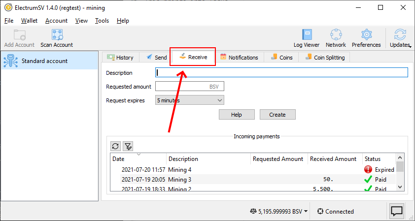
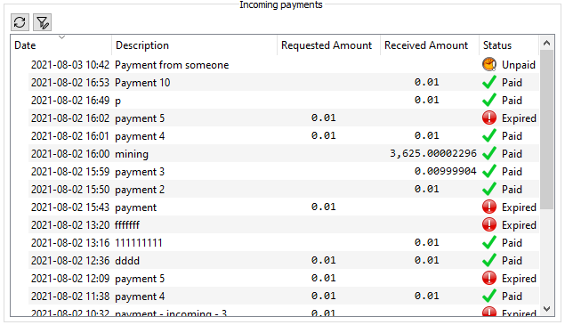
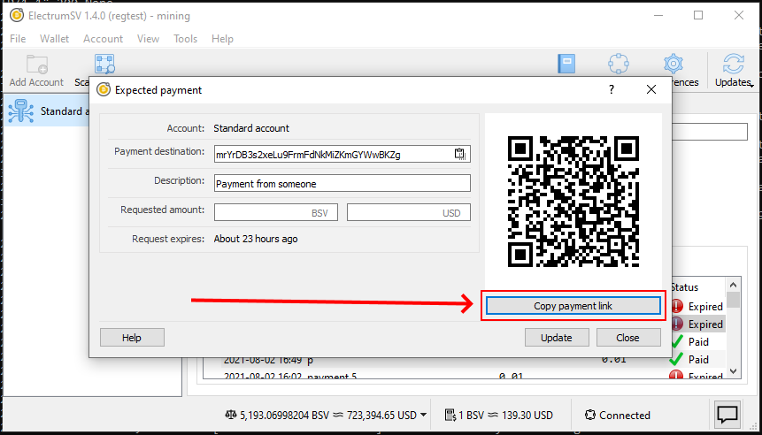
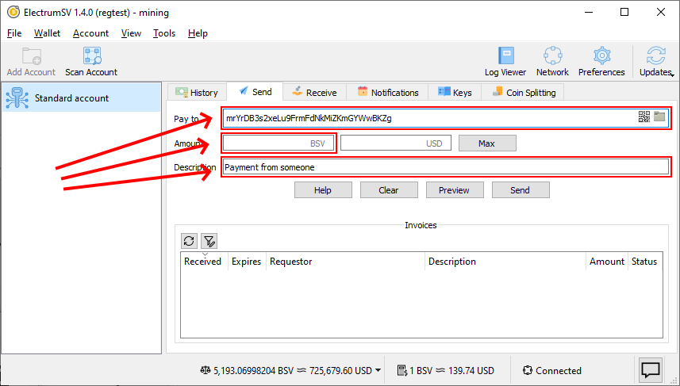
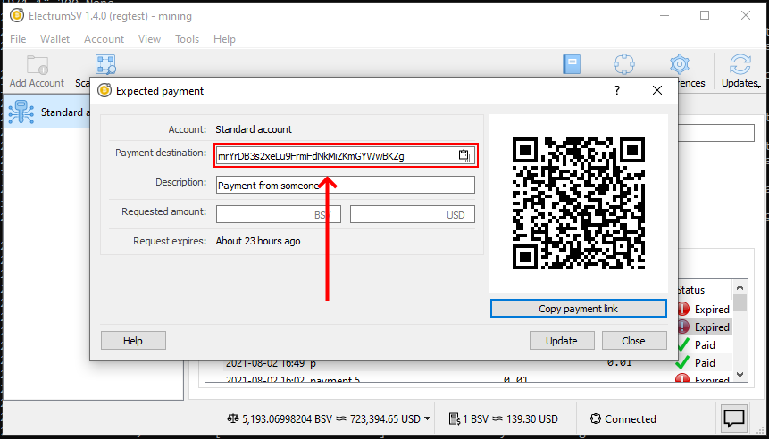

Receiving a payment
===================

An incoming payment is where you declare that you expect an incoming payment, and an address or
payment destination is allocated for you to give out. The wallet then monitors the blockchain for
usage of this payment destination for a payment, and closes out the incoming payment when
either an expiry time has passed or payment is detected, retrieved and processed.

When you want to create an incoming payment, the first thing you do is go to the "Receive" tab.
Here you can see a simple form you fill out to create a new incoming payment, and a list showing
existing incoming payments.

   The "Receive" tab where incoming payments are created and viewed.

The minimum information you need to provide when creating an incoming payment is the description.
If you provide no amount, it will be closed and considered paid if it receives any payment before
the expiration period ends. You can also opt not to provide an expiration period, and have it
sit there indefinitely. If it expires before the payer pays, then you can of course scan the
blockchain to detect it later.

.. figure:: images/receiving-a-payment-02-expected-payment-dialog.png
   :align: center
   :width: 90 %
   :alt: The "Expected payment" dialog shown when you create an incoming payment.

   The "Expected payment" dialog shown when you create an incoming payment.

This list is updated in real time. As the expiration period for an incoming payment ends, an
expected payment is marked as expired and we stop watching the blockchain for activity related to
it. As we detect activity related to an expected payment, we process those transactions and if
there is no requested amount or the incoming value in those transactions is greater than or equal
to the requested amount we mark the expected payment as paid and stop watching the blockchain
for activity related to it.

   The incoming payment list at the bottom of the "Receive" tab.

Giving out the payment destination
----------------------------------

There are several ways you can give the payment destination for your newly created expected
payment, to whomever you expect to pay it.

Copying the payment link
~~~~~~~~~~~~~~~~~~~~~~~~

The advantage of copying the payment link and giving it to your payer, is that they should just
be able to paste it into their wallet and they should see all the main details get incorporated
into their wallet's user interface. The payment destination itself, the amount and the
description of what the payment is for.

   The "Copy payment link" button.

The payment link from the screenshot above is as follows. It will of course differ for your payment.
The specification that defines these payment URLs is `BIP21`_.

.. _BIP21: https://github.com/moneybutton/bips/blob/master/bip-0021.mediawiki

``bitcoin:mrYrDB3s2xeLu9FrmFdNkMiZKmGYWwBKZg?sv&message=Payment%20from%20someone``

If you paste this payment link into the "Pay to" field in the "Send" tab, you can see how
ElectrumSV and ideally other wallets will populate for form for the payer. Note that the address
in the payment link is a testnet address, and is not usable on the real Bitcoin SV blockchain -
the mainnet.

   The "Send" tab form populated from the copied payment link.

Copying the raw payment destination
~~~~~~~~~~~~~~~~~~~~~~~~~~~~~~~~~~~

In some cases, you might just want to give the payer the raw payment destination which will either
be an address or a `BIP276`_ script.

.. _BIP276: https://github.com/moneybutton/bips/blob/master/bip-0276.mediawiki

   Copying the raw payment destination.

Using a QR code
~~~~~~~~~~~~~~~

If the other party is standing there with you, you can show them the expected payment dialog and
they can take a photo of the QR code with their wallet. Their wallet will extract the address and
streamline the payment process.

.. figure:: images/receiving-a-payment-04-expected-payment-dialog-qr-code.png
   :alt: The QR code provided in the expected payment dialog.
   :align: center
   :width: 80%

   The QR code provided in the expected payment dialog.

Identifying incoming payments
-----------------------------

In the legacy model, which is still the most common one, payments are fire and forget. The payer
constructs a transaction and broadcasts it to the blockchain. Then when your wallet gets a
notification a payment of interest has appeared in the blockchain, it retrieves that
transaction and factors it into the related account.

.. figure:: images/the-history-tab.png
   :alt: The history tab when awaiting an incoming payment.
   :align: center
   :width: 80%

   The history tab when awaiting an incoming payment.

With this model, the wallet has no idea a payment is incoming until it arrives out of the blue.
A new and better model is available in the form of Paymail, but ElectrumSV does not have the
service infrastructure to support it at this time. We are however working towards it.