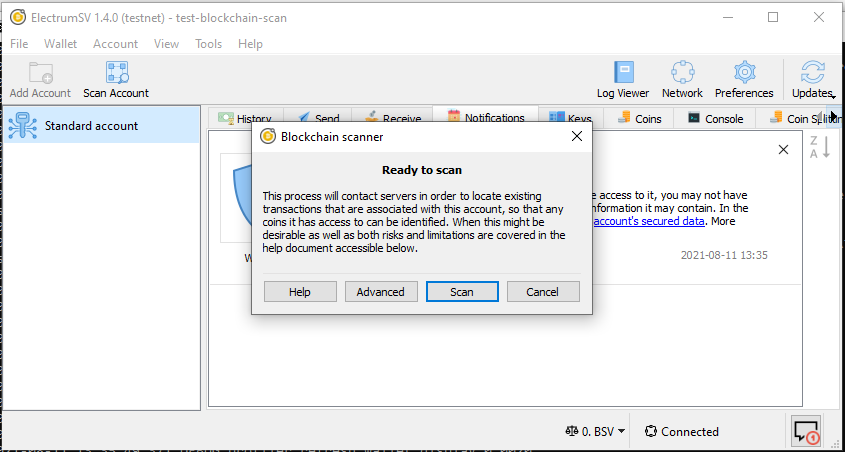
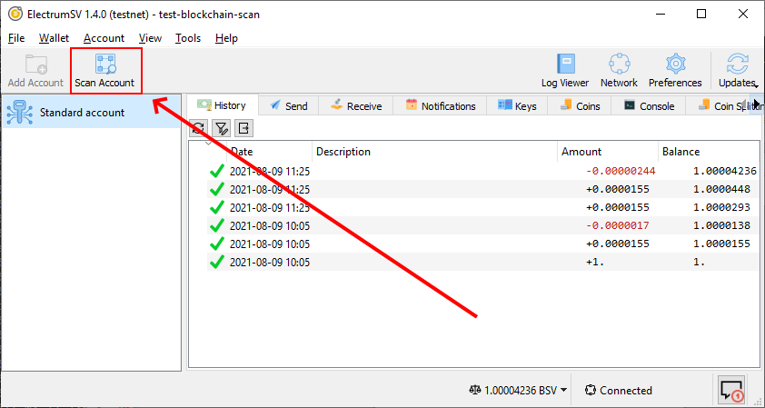
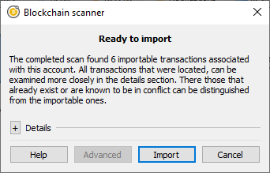
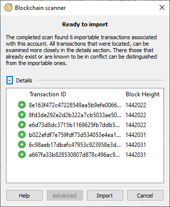
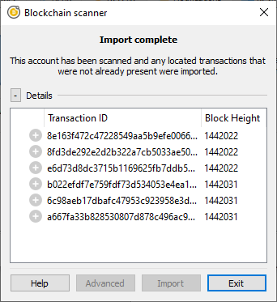
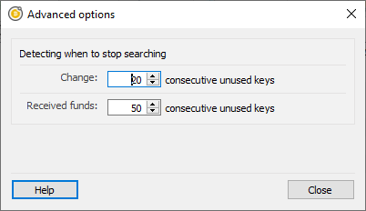

Scanning the blockchain
=======================

As long as there are servers that offer the ability to locate unknown transactions, ElectrumSV
will continue to support it. The main use of blockchain scanning, is locating the transactions
associated with the seed words or keys that a user imports. Additionally, in the short term before
the SPV model is formalised, it can also be used to find unexpected transactions the wallet does
not know to look for.

When you import existing seed words or keys
-------------------------------------------

When you create an account by importing existing keys, ElectrumSV should automatically show the
blockchain scanning user interface when the wallet window displays that account.

   The blockchain scanning window.

When you want to run the scanner manually
-----------------------------------------

The button to open the blockchain scanner is featured prominently in the wallet toolbar. It only
operates on the currently selected account, but should find any transaction relating to the account
that ElectrumSV itself is capable of creating or processing.

   The "Scan blockchain" button highlighted in the wallet window.

Operating the scanner
---------------------

The first step is to ensure you can see the blockchain scanning window. This will either be brought
up automatically when you create an account from existing keys, or when you click the button in the
toolbar.

   The blockchain scanning window.

Clicking on the "Scan" button will locate any key usage on the blockchain.

   The located payments after a scan.

By expanding the details section, users can see what transactions were located and decide if they
want to import them. At this time it is not possible for users to import some but not all of the
transactions, but that would be a good idea for improvement.

   The optionally viewable details of the located payments.

Once the import process is complete, the user will see the results. It is not guaranteed that all
the transactions will be imported. The most likely reason that a transaction won't be imported
is the presence of a conflicting transaction in the account. Another potential reason would be
bugs in ElectrumSV.

   The results of the payment import process.

Advanced: Extending the "gap limits"
~~~~~~~~~~~~~~~~~~~~~~~~~~~~~~~~~~~~

The BIP32 derivation paths that wallets have standardised on provide consecutive sequences of key
usage. An account looks on the blockchain to find transactions related to itself, to work out
it's current balance, available coins to spend and locate historical spends and receipts. This is
easily done by starting at the beginning of a derivation path and moving along it until no more
transactions are found. When there is a consecutive range at the end of the derivation path of
a given length (known as the gap limit) that is known to be unused, it is considered that there
are no more transactions.

Standards define both seed words [1]_, derivation paths [2]_ and types of payment. One of the
benefits of these standards is that with just the seed words a user can change wallets whenever
they want. In the short term, while wallets do not do very much besides send and receive coins
this works. In the longer term, wallets will do a lot more and it becomes impractical and
unsuited. However, there have been bugs in implementation where wallets have gone far beyond the
gap limit accidentally. For reasons like this in addition to the simple standardised wallet
recovery it is important that ElectrumSV enable users to find transactions beyond the gap limit.

   The blockchain scanning advanced options.

.. [1] `BIP39 seed words <https://github.com/electrumsv/bips/blob/master/bip-0039.mediawiki#abstract>`_ standard.
.. [2] `BIP32 derivation paths <https://github.com/electrumsv/bips/blob/master/bip-0032.mediawiki#the-default-wallet-layout>`_ standard.
