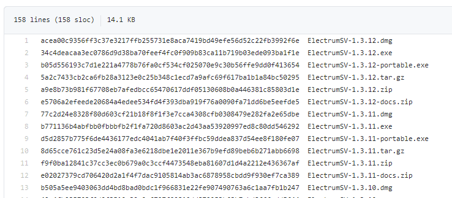
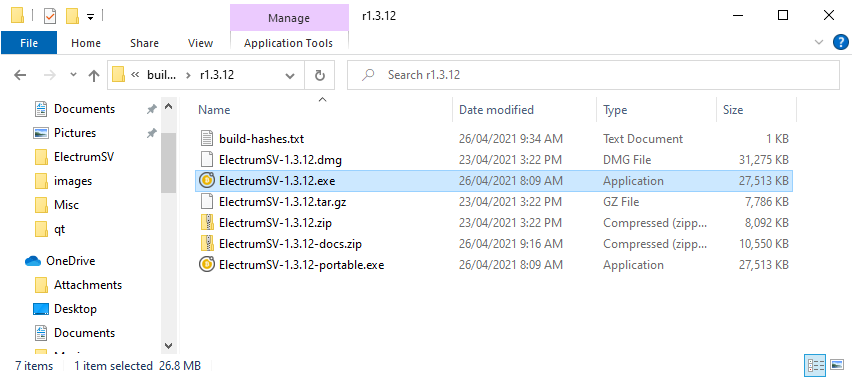
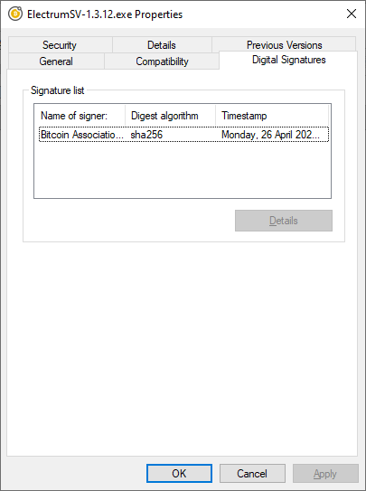
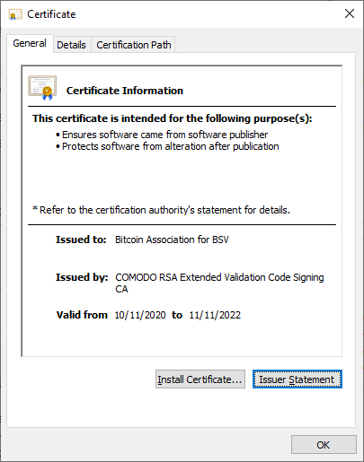
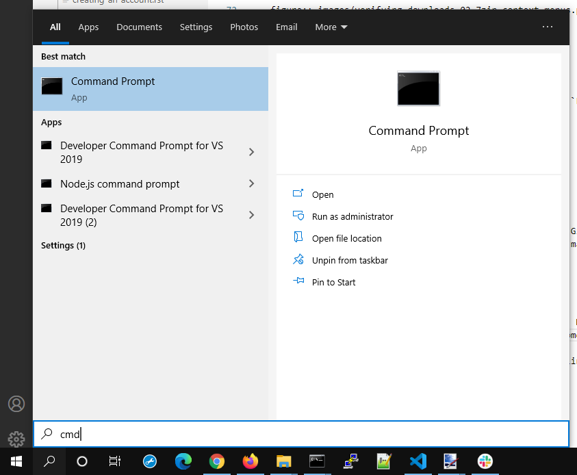
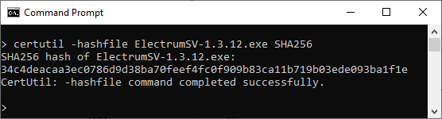
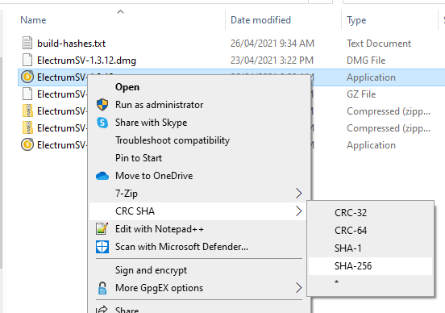
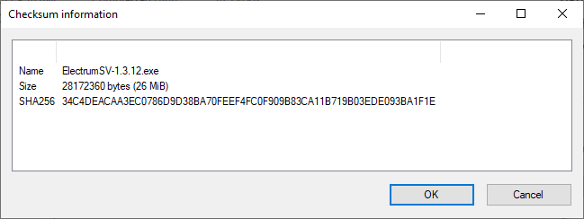
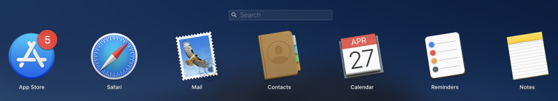
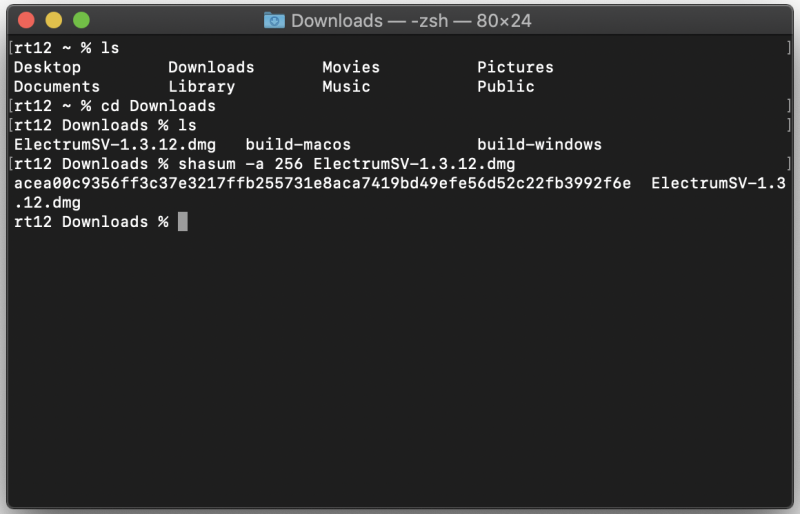

Verifying your download
=======================

Probably a dozen people have reported having their coins stolen, and any who were willing to
investigate found they had downloaded a malware version of ElectrumSV and not an official download.
More than one asserted that they had downloaded from our web site, but what they meant was that
they had downloaded from a fake web site that had stolen our design.

Downloading an executable from a web site and running it is risky, and what you are putting your
trust in, is that because you download from our official web site you are getting an executable
you can safely run. Despite this, well meaning people have downloaded from fake versions of our
web site, and paid the price for it.

It is in your best interests to verify your download is the official one. The goal of this page
is to try and show you how to do that.

What are you verifying?
-----------------------

You will be checking the checksum (also known as a hash) of the file you downloaded. This is a
standard algorithm that you can get lots of different software for, which will give you a series
of letters and numbers that represent the uniqueness of your file. The algorithm we use for
ElectrumSV is called SHA256 and we provide an official checksum for each file we make available.
You will be comparing that official checksum to the one generated for your file. If it is the
same, you should have the official version of that file. If it is different, you have downloaded
malware instead.

The official checksums
~~~~~~~~~~~~~~~~~~~~~~

We do not provide the checksums on the official web site where you find our download links, because
this allows any attacker who manages to compromise the web site, to also replace the official
checksums. Additionally, if there is a fake web site that offers both download links and checksums
you should know something is fishy.

The official checksums are
`available from Github <https://github.com/electrumsv/electrumsv/blob/master/build-hashes.txt>`__,
where our open source code is located. You do not need to compare against the illustrative
screenshot below, just click on the Github link and view them there.



   The list SHA256 hashes for the official downloads.

Verifying your download
-----------------------

There is no easy way to check a download. Some level of technical competence is useful, although
if you do not consider yourself technically competent and can follow instructions you should still
be able to do it. Others have managed to do it, and as we get these instructions into a more
approachable state over time, you should be able to as well.

Find your operating system below, and check out the options listed for it. Some of them may be
better than others, but some assurance that your download is legitimate is better than nothing.

Windows
~~~~~~~

Several methods of verifying your download on Windows are provided below. Any one should be good
enough, but if you are a user who primarily uses a web browser you may need to learn to use the
explorer or console.

Using the digital signatures
````````````````````````````

Thanks to the kindness of the Bitcoin Association, we now have the ability to sign our Windows
executables from version 1.3.12 and above. In theory the presence of our signature on the
executable you downloaded should be just as reliable as checking the checksum. You can check if
the executable you downloaded has our signature, and if it is present you can assume that the file
should be legitimate.  Your first step is to find the executable you downloaded with the Windows
explorer. You can open the Windows explorer with the ``windows`` and ``e`` key, then locate the
directory your executable is located in.



   Windows explorer.

Right click on the file, and select ``Properties``. This should open the properties window for the
file, where you should select the ``Digital Signatures`` tab to see the signature.



   The digital signature.

From there click on ``Details`` and then ``View Certificate``. You should see a certificate with
the following information for the given version.

1.3.12
^^^^^^

The certificate should be issued to ``Bitcoin Association for BSV``, be issued by
``COMODO RSA Extended Validation Code Signing CA`` and as of the time of writing be valid
from ``10/11/2020`` to ``11/11/2022``.



   The certificate the file was signed with.

Using certutil
``````````````

``certutil`` is already present in your Windows installation already. However, it requires opening
a command prompt to run it, which might be something beyond some users. Press the `Windows` key and
the ``s`` key at the same time, this will open the Windows searchy thing and there you can type
``cmd`` and then press the ``enter`` key to open a command prompt.



   Opening a command prompt.

Then you need to change the directory until you are in the same directory as the file you wish
to get a checksum for. The ``cd`` command is used for this. Then you can use the certutil command
to generate a SHA 256 checksum for that file. The syntax is
``certutil --hashfile <filename> SHA256``, but remember you need to replace ``<filename>`` with
the actual file name. You can see an illustration of this in the image below.



   The certutil checksum result.

If you find the ``ElectrumSV-1.3.12.exe`` entry in the
`linked Github list <https://github.com/electrumsv/electrumsv/blob/master/build-hashes.txt>`__,
you can see it matches the certutil checksum result. The case of the letters does not matter,
both lower case and upper case are equivalent. If you get a different result, and the command
complains that it cannot find the file, then the file is not in the current directory. You need
to use the ``cd`` command to change the current directory as mentioned above.

Using 7-Zip
```````````

This requires that you download the 7-Zip installer. Any of the non-standalone executables from
the `7-Zip web site <https://www.7-zip.org/download.html>`__, should be fine. Download one and
install it. Once it is installed, you should have a handy context menu available that can give
you the SHA 256 checksum for your file. Simply select your file, open the context menu and
generate the checksum. Do not reflect on the fact that no-one in their life ever wanted to
"Share with Skype" and that they put it up the top before all the useful stuff.



   The 7-Zip context menu.

In this case, we selected the ``SHA-256`` menu option for the ``ElectrumSV-1.3.12.exe`` file and
the following image shows the resulting checksum.



   The 7-Zip checksum result.

If you find the ``ElectrumSV-1.3.12.exe`` entry in the
`linked Github list <https://github.com/electrumsv/electrumsv/blob/master/build-hashes.txt>`__,
you can see it matches the 7-zip checksum result. The case of the letters does not matter, both
lower case and upper case are equivalent.

MacOS
~~~~~

At this time, only one method of verifying your downloaded file is provided.

shasum
``````

This approach requires no application installation, but it does involve you being willing to
use the ``terminal`` application. If you do not know how to locate this, start by opening the
``launchpad`` application using it's rocket icon in the dock.


   Open the launchpad application search.

You should see the screen shown below. Enter ``terminal`` and it should show you one matching
application which you should open.



   Search for the 'terminal' application.

Work out what directory the terminal is looking at, and change it using the ``cd`` command. In the
case shown below, the downloaded file was conveniently located in the ``Downloads`` folder and
as this should also be the case for you the required commands should be the same.
Type ``cd Downloads`` followed by ``shasum -a 256 <filename>`` where you replace ``<filename>``
with the actual file name of your download. Shown below, the file name was
``ElectrumSV-1.3.12.dmg`` and if you downloaded this file you also would use
``shasum -a 256 ElectrumSV-1.3.12.dmg`` as shown.



   Run the 'shasum' application on your downloaded file.

If you find the ``ElectrumSV-1.3.12.dmg`` entry in the
`linked Github list <https://github.com/electrumsv/electrumsv/blob/master/build-hashes.txt>`__,
you can see it matches the ``shasum`` checksum result. The case of the letters does not matter,
both lower case and upper case are equivalent. If you get a different result, and the command
complains that it cannot find the file, then the file is not in the current directory. You need
to use the ``cd`` command to change the current directory as mentioned above.

