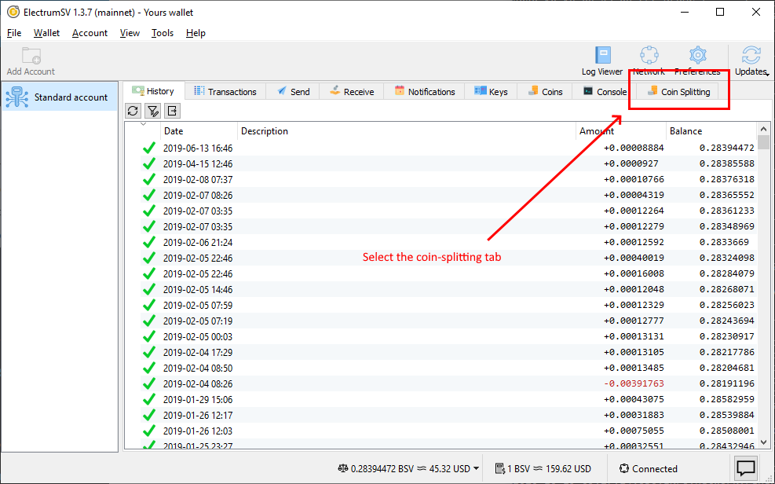
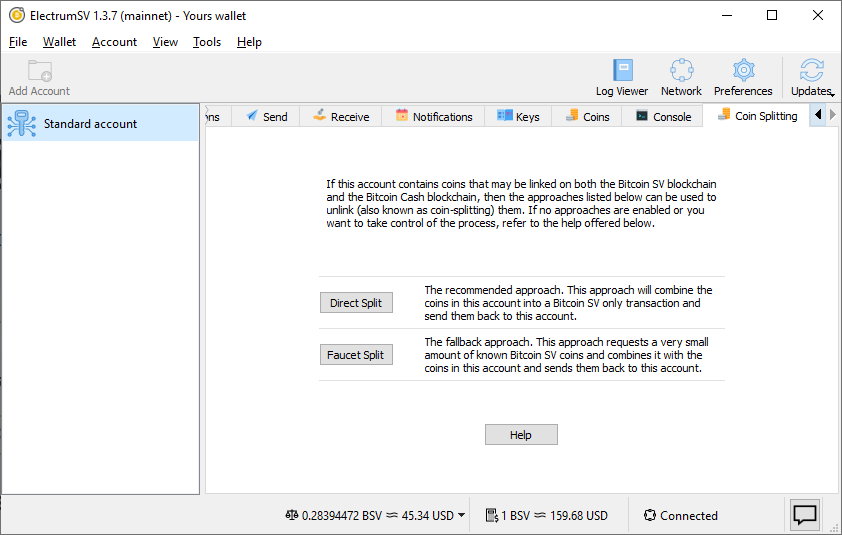
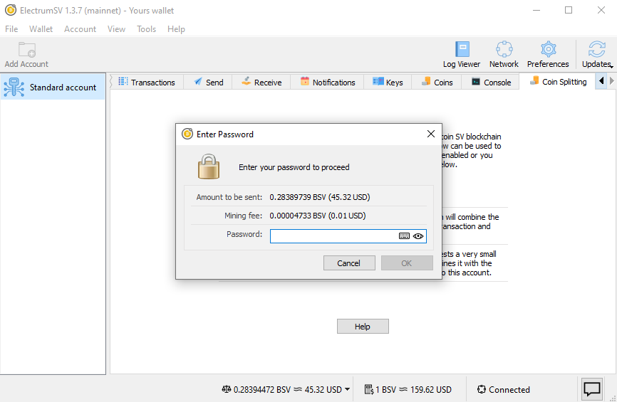
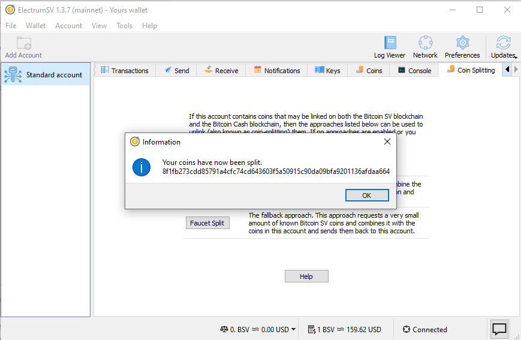
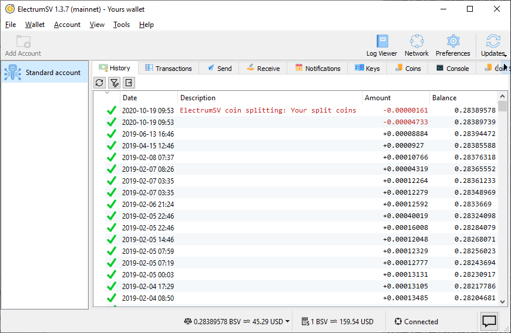
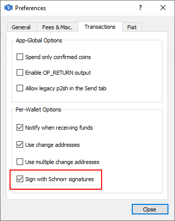

Coin splitting
==============

.. important::
   ElectrumSV can only be downloaded from `electrumsv.io <https://electrumsv.io>`_.

When users have coins that existed before Bitcoin Cash became a separate blockchain from Bitcoin
SV, those coins are linked on both blockchains. When they are sent in a wallet on one blockchain,
that action can also send them on the other blockchain. Users have had this accidentally happen
to them, and the recipient has refused to refund the coins from the blockchain the user did not
intend to send on.

If you think you have unsplit coins in your wallet, you can use ElectrumSV's coin-splitting
feature to split them. But keep in mind that you are responsible for your own coins, you should
verify for yourself that the splitting worked. And if you are unsure whether your coins need
to be split, you can always split them anyway.

How does splitting work?
------------------------

The process is simple, if the coins are sent on Bitcoin SV in a way that is incompatible with
Bitcoin Cash, then the coins are split. Any usage of those specific coins that have been split
will from then on be independent on either blockchain.

In order to keep it simple, we only do the simplest case. We make your wallet do a payment
to itself that combines all the available coins within it in a way that should be valid on
Bitcoin SV and not Bitcoin Cash. This results in one single split coin combining all the individual
coins that you had in your wallet before the split.

How you split your coins
------------------------

Unfortunately, all the coins in the wallet used here are already split. So the following is just
going through the process to show you how it works. You can see that this wallet contains a
small amount of Bitcoin SV.

Let's start by changing to the coin-splitting tab:

   Selecting the coin-splitting tab.

Once you are looking at the coin-splitting tab, you have two options. Either direct splitting
or faucet splitting. We recommend the direct splitting, and do not really support the faucet
splitting any more. Direct splitting does not work for hardware wallets, which due to inherent
limitations can only work in simple ways.

   The coin-splitting tab.

Clicking on the direct splitting button will ask you for your password. You will see that the
balance of the splitting transaction is the balance of the available coins in the wallet.

   Approve the splitting payment.

After you enter your password, it will sign and broadcast your transaction. This will happen
pretty quickly, and once it is done you will see a dialog letting you know the splitting
transaction was broadcast.

   The split action completion message.

You can now go back to the history tab and see the splitting transaction there, which has an
automatic description noting what it was created for.

   The history tab with the splitting transaction.

In theory, your coins should be split. But again, you are responsible for using them safely
and you should ensure that they are really split.

Ensuring your coins are split
-----------------------------

Bitcoin is complicated, and in order to really know for yourself that your coins are split, you
need to have some level of technical understanding. It's a lot simpler to just send them to
different places on both blockchains, especially safe places like your own wallet's receiving
addresses and check that they get there - so just do that!

Here is one way to do it:

1. Do a direct split in ElectrumSV.
2. Open your Bitcoin Cash wallet with the coins that were linked to Bitcoin SV, that you just
   split in ElectrumSV.
3. Create a new empty Bitcoin Cash wallet.
4. Send the coins in your existing Bitcoin Cash wallet to the new Bitcoin Cash wallet.

You can then observe that your Bitcoin Cash is in a new fresh wallet, and your Bitcoin SV is
in the old wallet. Neither moved because the other moved, but rather both were moved by you. You
might wonder why you need to create a second Bitcoin Cash wallet, and the reason is that this
ensures that your Bitcoin SV and Bitcoin Cash are using different keys and it both helps
verify they are unlinked and gives you better security going forward.

Hardware wallets
----------------

Hardware wallets are extremely limited devices with not much flexibility. They only allow certain
types of transactions to be signed, and this does not include the type that the direct splitting
method uses.

If you have a hardware wallet, you can try and use faucet splitting. Faucet splitting works by
adding a very small Bitcoin SV coin to your wallet, then combining all the available coins in
your wallet with that Bitcoin SV coin. This creates a new Bitcoin SV coin which is of course
incompatible with the Bitcoin Cash blockchain, and so the coins in the wallet have been split.

Alternatively, if the faucet is not working you can get someone to send you a very small amount
of Bitcoin SV and you can accomplish the same thing yourself by sending all the coins in your
wallet to one of your own addresses (including that very small amount of Bitcoin SV).

Increasing differences between blockchains
------------------------------------------

There are an increasing number of changes between Bitcoin Cash and Bitcoin SV. While it is
good practice to split your coins just in case you lose your Bitcoin SV when sending your
Bitcoin Cash, or lose your Bitcoin Cash when sending your Bitcoin SV, it is possibly becoming
easier to avoid it.

High minimum fee on Bitcoin Cash
~~~~~~~~~~~~~~~~~~~~~~~~~~~~~~~~

The Bitcoin Cash servers for the Electron Cash wallet rejected any attempt to broadcast a
transaction containing unsplit coins that had 0.5 satoshis per byte fee as too low. Experiments
suggest that it is very difficult to get a transaction at this fee level to propagate, maybe
nearing impossible.

As the default fee in ElectrumSV is 0.5 satoshis per byte, this could mean that if you send
unsplit coins in ElectrumSV the Bitcoin Cash network will completely ignore them. Should you rely
on this? No, but it might provide a coincidental safety net for people who do not know they
should split their coins.

Schnorr signatures
~~~~~~~~~~~~~~~~~~

By default Electron Cash and likely all Bitcoin Cash wallets now use Schnorr signatures. What
this means is that the transactions they make should be incompatible with Bitcoin SV as long as
the user has not opted out of using Schnorr. So in theory you can just send your coins on
Bitcoin Cash and because those Schnorr signatures are used, the coins on Bitcoin Cash have been
sent in a way that is incompatible with Bitcoin SV.

   The default Electron Cash Schnorr setting.

Should you rely on this? Not unless you know for sure that you are using Schnorr signatures
in your Bitcoin Cash wallet, and that you have used the correctly.

Thanks
------

Many thanks to `satoshi.io <https://satoshi.io/>`_ who provided unsplit coins used for testing
related to this article.