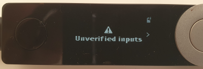
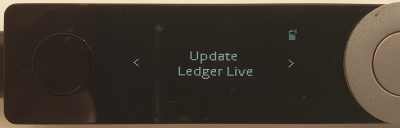
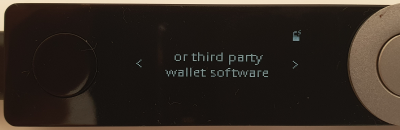
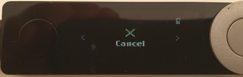
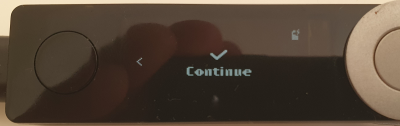
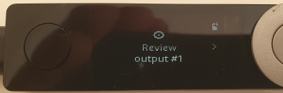
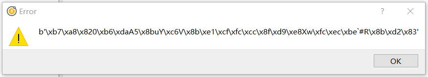
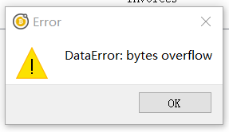

Hardware wallet issues
======================

Ledger
------

While Ledger as a company do not support Bitcoin SV as a coin on their device, users have been
able to use their Ledger devices with ElectrumSV through compatibility with the Bitcoin Cash
support.

The Ledger device reports "unverified inputs"
~~~~~~~~~~~~~~~~~~~~~~~~~~~~~~~~~~~~~~~~~~~~~

You go to sign your transaction and your Ledger device has a confusing series of screens talking
about "unverified inputs" and updating your device and/or software. You can simply step through
these screens and select continue. These screens will be shown below, and then a detailed
explanation of why you are seeing them will be provided.

The short version is that you can continue past these screens to signing your transaction as you
signed it before you started seeing these messages, and it will be as secure as it was then. Just
make sure you only sign it once, and if ElectrumSV asks you to resign it over and over not
recognising that you did it once, you are probably using malware. Again, see below the screens
for an explanation of this in more detail.

It should not be necessary to update your Ledger firmware and applications to deal with this.

It should not be necessary to update ElectrumSV, although you should always be using the latest
version.

You can cancel the signing of the transaction if you want.

But if you select the "continue" option, the Ledger device will go through the normal transaction
signing process.

As you might recall, the first step of the correct signing process is to confirm where you are
sending funds. And this is where the process is now at. You can go ahead and sign the transaction
as you would have in the past before this confusing message.

Why do I see this "unverified inputs" message?
##############################################

A theoretical but unlikely exploit was discovered where wallet malware could direct a user to sign
a transaction several times, and extract the signed spends from each and combine them into a new
transaction which gave a large fee to miners. Trezor wrote an `article about it <https://blog.trezor.io/details-of-firmware-updates-for-trezor-one-version-1-9-1-and-trezor-model-t-version-2-3-1-1eba8f60f2dd>`_
which you can read if you wish. You see this warning because ElectrumSV is not providing the
previous transactions in which the spent coins were originally received to the Ledger device.

The simple reason we do not provide the previous transaction data is because Ledger cannot handle
it and will break. You can see in the Trezor hardware issues a "DataError: bytes overflow" error,
which their users may encounter. We have to provide these transactions to the Trezor devices but
they cannot handle them and they break, this means that Trezor users have to be careful not to
spend anything other than the simplest of received payments in their transactions themselves and
work out what they can and can't spend themseves. If any of their coins is not simple and cannot
be handled by Trezor, they need to bypass their hardware wallet and spend them in an unsafe way
by entering their seed words.

Back to Ledger devices. Ledger allow the transaction to be signed without the spent transaction
data, and on detecting they do not have it, they show an "unverified inputs" message. This makes
it a little lot for Ledger users. They can still sign a spend they are confident is going to the
correct places, and not bypass their hardware wallet to do so. Let's be honest, if someone is going
to all the effort of writing malware it has never in the history of malware been to give the stolen
coins to miners. The chances of downloading malware are slight, and the chances of downloading
malware that gives coins to anyone other than the thief are even slighter.

Trezor
------

While Trezor as a company do not support Bitcoin SV as a coin on their device, generally Bitcoin SV
users have been able to use their Trezor devices with ElectrumSV by having it in the Bitcoin Cash
coin mode. However, users are encountering situations where the limitations of the Trezor device
result in it no longer being sufficient to work with Bitcoin SV transactions. This likely means
that if a user is planning to continue to use a Trezor device, it may require them to jump through
hoops to do so.

There are two complications:

- Later versions of firmware (starting with 1.9.1 for One and 2.3.1 for Model T) require ElectrumSV
  to pass in parent transactions with the transaction you are signing. ElectrumSV only started
  supporting this in ElectrumSV 1.3.8 or newer. What this means is that if you are using these
  later versions of firmware, you must be using ElectrumSV 1.3.8 or newer - or it will error.
- Bitcoin SV transactions can have large output scripts, larger than what Trezor can handle.
  Trezor can only sign simple payments and nothing else, but this does not prevent payments from
  being made into the wallet with additional output scripts added for other reasons that exceed
  Trezor's size limit of 15 kilobytes. The parent transaction processing in the Trezor device will
  error when it encounters these.

Trezor devices are becoming problematic for Bitcoin SV users to use. While they are polished and
enjoyable devices to use, unless the large output problem is solved by Trezor, we cannot
recommend users buy these devices unless they accept they have to own and deal with these problems.
For this reason it is recommended that Trezor users downgrade their devices.

Downgrading your Trezor device
~~~~~~~~~~~~~~~~~~~~~~~~~~~~~~

These are Trezor's firmware version pages, for users who plan to downgrade:

- Trezor One: `1.9.0 <https://github.com/trezor/webwallet-data/blob/master/firmware/1/trezor-1.9.0.bin>`_.
- Trezor Model T: `2.3.0 <https://github.com/trezor/webwallet-data/blob/master/firmware/2/trezor-2.3.0.bin>`_.

You will need to visit those pages and download the firmware file. Trezor
`provide instructions <https://wiki.trezor.io/Firmware_downgrade>`_ on how to downgrade, and
let you know how and where to use the file.

Problem: You see a random looking series of numbers and letters
~~~~~~~~~~~~~~~~~~~~~~~~~~~~~~~~~~~~~~~~~~~~~~~~~~~~~~~~~~~~~~~

   What this problem looks like..

You are using ElectrumSV 1.3.7 or earlier, and your Trezor device has a later version of the
firmware. It expects ElectrumSV to have provided the transaction associated with those numbers
and letters, but the ElectrumSV version you are using does not know how to or even that it should.
You can take the risk of updating to a more recent version of ElectrumSV that supports these
parent transactions, and possibly encounter the "DataError: bytes overflow" problem. Or you can
downgrade your Trezor firmware to the version listed above.

Problem: You see the message "DataError: bytes overflow"
~~~~~~~~~~~~~~~~~~~~~~~~~~~~~~~~~~~~~~~~~~~~~~~~~~~~~~~~

   What this problem looks like..

One of your parent transactions contains not only the coin you are trying to spend, but a large
output script. Your Trezor device has a later version of firmware where parent transactions are
required to be provided, and the device is choking on the large output. This is a limit in the
device itself, and ElectrumSV can do nothing about this. To spend the coin associated with the
problem parent transaction, you need to downgrade your firmware to the versions listed above.
